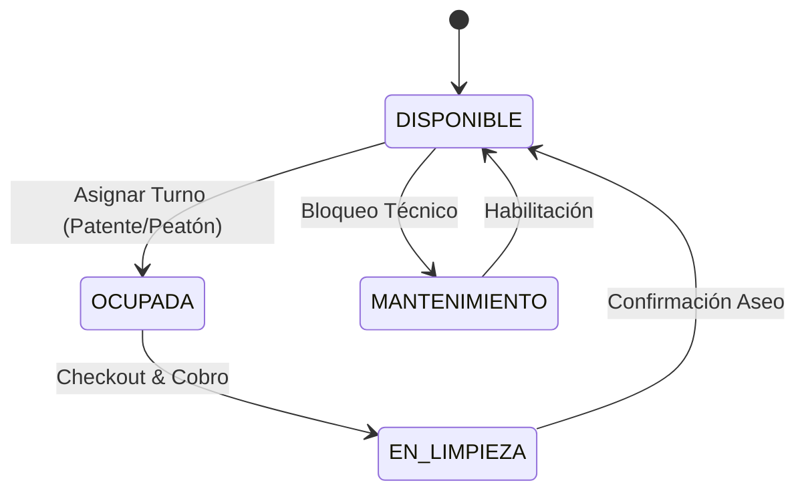

# Especificación Técnica del Prototipo v0 (MVP)

**Fecha de Validación:** 03/09/2026  
**Validado con:** C.C. (Gerente Propietario del Motel C.C.)  
**Enfoque:** Maqueta de baja fidelidad y flujo de interacción reactivo.

---

## 1. Módulos Principales

### A. Panel Reactivo de Conserjería (Máquina de Estados)
Visualización interactiva de las 13 habitaciones del establecimiento en una Single Page Application (SPA).
- **Estados de Habitación:**
  - `DISPONIBLE` (Gris/Verde): Lista para asignación.
  - `OCUPADA` (Rojo): Cronómetro activo accionado en el servidor.
  - `EN_LIMPIEZA` (Amarillo): Proceso de aseo tras checkout.
  - `MANTENIMIENTO` (Azul): Bloqueada por reparaciones.
- **Transición de Turno:**
  1. Conserje selecciona habitación `DISPONIBLE`.
  2. Ingresa patente o categoría genérica ("Peatón").
  3. Sistema inicia temporizador backend y bloquea el estado.
  4. En checkout, el sistema calcula automáticamente la tarifa por fracción/pernocte + comanda de consumo.

### B. Formulario de Cierre de Caja Ciego (Anti-Fraude)
1. Al finalizar el turno de guardia (Mañana, Tarde o Noche), el conserje solicita el cierre.
2. El sistema **no muestra** el total recaudado por el servidor.
3. El operador declara obligatoriamente el importe en efectivo físico presente en caja.
4. El backend contrasta el monto declarado vs. el saldo real de la máquina de estados.
5. Se registra la transacción imborrable con timestamp, operador, y cualquier faltante/sobrante.

### C. Manejo de Evento Contingente (Anulación Auditada)
- Prohibición de borrado de registros CRUD.
- En caso de error operativo, la transacción pasa a estado `TURNO_ANULADO`.
- Requiere justificación textual obligatoria y firma digital del operador.
